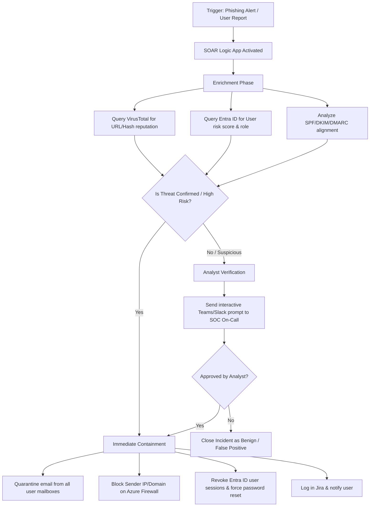

# Playbook 01 — Phishing Triage

**Last Updated:** February 2026
**Severity:** Medium (suspicious email) to High (user clicked / credential harvesting confirmed)
**MITRE ATT&CK:** T1566.001 (Spearphishing Attachment), T1566.002 (Spearphishing Link), T1204.001 (Malicious Link), T1204.002 (Malicious File)
**SLA:** Initial triage within 15 minutes; containment within 1 hour if confirmed malicious

---

## Indicators That Trigger This Playbook

- User-reported suspicious email via phishing report button or helpdesk ticket
- Email gateway alert for malicious attachment or link
- SIEM alert for execution of a document macro or Office spawning cmd/powershell
- Endpoint alert for download of a suspicious file from an email client
- DNS alert for connection to a newly-registered or known-phishing domain

---

## Pre-Triage Checklist

Before starting, gather the following information from the alert or ticket:

- [ ] Affected user full name, email address, and department
- [ ] Hostname of the user workstation
- [ ] Time the email was received
- [ ] Email sender address and display name
- [ ] Email subject line
- [ ] Any attachment names or URLs in the email
- [ ] Did the user click a link, open an attachment, or enter credentials?

---

## Triage Steps

### Step 1 — Assess User Interaction (do this first)

**Question:** Did the user click a link, open an attachment, or submit credentials?

Contact the user by phone (preferred — do not use email as the mailbox may be compromised).

| User Response | Next Step |
|--------------|-----------|
| No interaction — just reported it | Proceed to Step 2 (lower urgency) |
| Clicked a link but did not enter anything | Step 3 — investigate endpoint |
| Opened an attachment | Step 3 — investigate endpoint (HIGH urgency) |
| Entered credentials | Step 4 — credential compromise response (HIGH urgency) |

---

### Step 2 — Analyse the Email

**Header analysis:**
- Does the From domain match the Return-Path and Reply-To? Mismatch is suspicious.
- Check SPF, DKIM, DMARC authentication results in the Received headers.
- Note originating IP — look it up in AbuseIPDB and MXToolbox.

**URL analysis (if email contains links):**
- Extract and defang URLs before sharing: replace https:// with hxxps://
- Check in VirusTotal, URLScan.io, URLhaus
- Check domain age (Whois): domains registered less than 30 days ago are high-risk

**Attachment analysis (if applicable):**
- Get SHA256 hash from email gateway or endpoint
- Check hash in VirusTotal
- If unknown: submit to any.run or Hybrid Analysis sandbox
- Common suspicious types: .docm, .xlsm, .js, .vbs, .iso, .lnk, .html (credential harvest pages)

---

### Step 3 — Investigate the Endpoint

If the user clicked a link or opened an attachment, investigate their workstation.

**Check for process execution triggered by the email client (KQL — Sentinel with MDE):**

```kql
DeviceProcessEvents
| where InitiatingProcessFileName in~ ("winword.exe","excel.exe","outlook.exe","powerpnt.exe")
| where FileName in~ ("cmd.exe","powershell.exe","wscript.exe","cscript.exe","mshta.exe","certutil.exe")
| where DeviceName == "WORKSTATION-NAME"
| where Timestamp >= ago(4h)
| project Timestamp, DeviceName, InitiatingProcessFileName, FileName, ProcessCommandLine
```

**Check for suspicious file downloads:**

```kql
DeviceFileEvents
| where DeviceName == "WORKSTATION-NAME"
| where Timestamp >= ago(4h)
| where FolderPath has_any ("Downloads", "Temp", "AppData\Local\Temp")
| where FileName endswith_cs ".exe" or FileName endswith_cs ".dll" or FileName endswith_cs ".ps1"
| project Timestamp, FileName, FolderPath, SHA256, InitiatingProcessFileName
```

---

### Step 4 — Credential Compromise Response

If the user entered credentials on a phishing page, take these immediate actions:

1. **Reset the user password immediately** — contact IT helpdesk or action directly with AD/Entra ID access
2. **Revoke all active sessions** — in Entra ID: User > Sessions > Revoke all sessions
3. **Check for MFA changes** — did the attacker register a new MFA device after compromise?
4. **Check for email forwarding rules** — attackers often set inbox rules to forward copies of all mail externally
5. **Check for OAuth app consent grants** — attackers use phishing to gain malicious OAuth app access

---

## Containment Steps

| Situation | Action |
|-----------|--------|
| Malicious URL identified | Block the URL/domain in web proxy and DNS filter; add IoC to SIEM watchlist |
| Malicious attachment hash | Block hash in endpoint security policy; submit to AV vendor |
| User clicked link, no credential entry | Monitor endpoint for 48h; no isolation unless malware detected |
| Malware executed on endpoint | Isolate workstation immediately via EDR |
| Credential harvested | Password reset + session revoke + MFA audit |
| Multiple users targeted | Notify email security team; quarantine the campaign from all mailboxes |

---

## Escalation Criteria

Escalate to Tier-2 or IR team if any of the following are true:

- User entered credentials and attacker had access for more than 30 minutes before detection
- Malware was executed on the endpoint
- More than 5 users in the organisation received the same phishing campaign
- Evidence of lateral movement or data access following the phishing
- The targeted user is a privileged account (IT admin, finance, executive)

---

## Closure Criteria

Close the incident if all of the following are true:

- Email confirmed as phishing (or confirmed safe if false positive)
- No malware execution confirmed
- No credentials harvested, or password reset completed if they were
- Indicators of compromise (IoCs) blocked in relevant controls
- Affected users notified and awareness reminder sent

---

## Documentation Template

```
INCIDENT SUMMARY
Incident ID:
Date/Time:
Analyst:
Severity:

AFFECTED USER
Name:
Email:
Department:
Workstation hostname:

EMAIL DETAILS
Sender address:
Subject:
Received at:
Attachment filename and hash:
URLs (defanged):
SPF/DKIM/DMARC result:

USER INTERACTION
Clicked link: Yes / No
Opened attachment: Yes / No
Entered credentials: Yes / No
Details:

INVESTIGATION FINDINGS
URL reputation:
Attachment sandbox result:
Endpoint process analysis summary:
Credential exposure confirmed: Yes / No

CONTAINMENT ACTIONS TAKEN
[ ] URL/domain blocked
[ ] Hash blocked on endpoint
[ ] Password reset
[ ] Sessions revoked
[ ] Endpoint isolated
[ ] Email quarantined from other mailboxes

ESCALATED: Yes / No
If yes, to whom and at what time:

FINAL DISPOSITION
True Positive / False Positive / Benign Positive
Closed by:
Closed at:
```

---

## 🤖 Automated Response (SOAR / Azure Logic App Workflow)

To reduce Mean Time to Respond (MTTR), manual triage steps are augmented using an automated Azure Logic App workflow triggered by Microsoft Sentinel:



### Automation Details:
- **Trigger**: Microsoft Sentinel Incident Created (Phishing / Suspicious Email).
- **Security Integrations**:
  - **Microsoft Defender for Office 365**: Automates the search-and-purge (quarantine) of the malicious email campaign across the entire Microsoft 365 tenant.
  - **Microsoft Entra ID (Azure AD)**: Instantly resets passwords and revokes current authentication tokens for compromised users using the Azure AD connector.
  - **VirusTotal API / URLScan.io**: Automated lookup of extracted indicators of compromise (IoCs) to check reputation.
  - **Adaptive Teams Card / Slack Webhook**: Sends an interactive notification card to the security operations channel, enabling Tier-1 analysts to authorize endpoint isolation or campaign quarantine with a single click.
