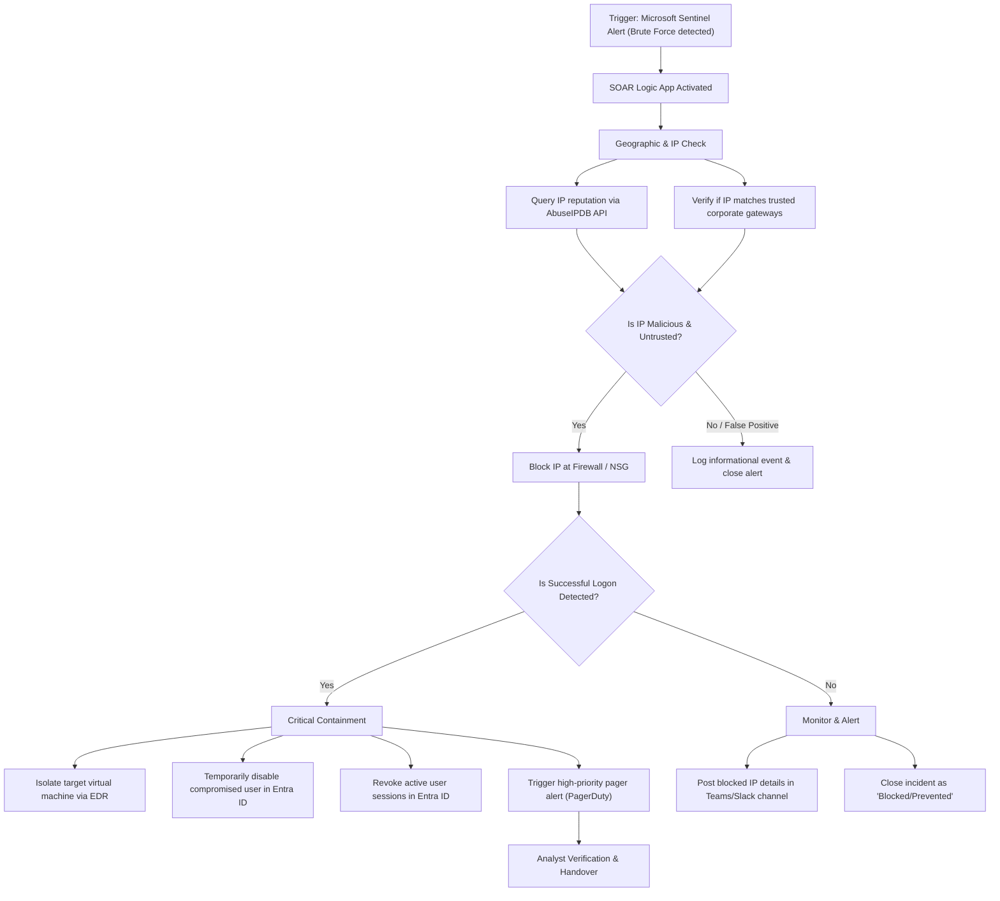

# Playbook 02 — Brute Force Detection

**Last Updated:** February 2026
**Severity:** Medium (failed attempts, no success) to High (successful logon following brute force)
**MITRE ATT&CK:** T1110.001 (Brute Force: Password Guessing), T1110.003 (Brute Force: Password Spraying)
**SLA:** Initial triage within 15 minutes

---

## Indicators That Trigger This Playbook

- SIEM alert: multiple failed authentication events (Event ID 4625 on Windows; auth.log failures on Linux) from a single source IP within a short window
- Alert: account lockout for multiple accounts in a short timeframe
- Alert: single account with excessive failed logons (potential targeted brute force)
- Azure AD / Entra ID alert: many failed sign-in attempts against a user account

---

## Pre-Triage Checklist

- [ ] Source IP address(es) of the failed logon attempts
- [ ] Target system(s) or account(s)
- [ ] Number of failed attempts and time window
- [ ] Whether any logon attempt succeeded
- [ ] Protocol/service being targeted (RDP, SMB, SSH, VPN, web portal)

---

## Triage Steps

### Step 1 — Determine if Any Logon Succeeded (CRITICAL — first question)

This single question determines whether the incident is a failed attack or an active compromise.

```kql
// Check for successful logon from the same source IP
SecurityEvent
| where IpAddress == "ATTACKER-IP"
| where EventID == 4624
| where TimeGenerated >= ago(2h)
| project TimeGenerated, Computer, TargetUserName, IpAddress, LogonType
```

Also check a broader window in case the attacker paused after obtaining credentials:

```kql
// Successful logon from attacker IP in wider window
SecurityEvent
| where IpAddress == "ATTACKER-IP"
| where EventID == 4624
| where TimeGenerated >= ago(24h)
```

**If any success is found:** Jump to Step 5 — Compromise Response.
**If no success:** Continue to Step 2.

---

### Step 2 — Classify the Attack Type

**Password Guessing (single account targeted):**
- High number of attempts against one account from one or few source IPs
- Attacker is trying to guess the specific account password

**Password Spraying (many accounts, few attempts each):**
- Low number of attempts per account (1–5) but many different accounts targeted
- Designed to avoid account lockout thresholds
- Often indicates a more sophisticated attacker with a valid username list

```kql
// Identify attack type: guessing vs spraying
SecurityEvent
| where EventID == 4625
| where TimeGenerated >= ago(1h)
| summarize
    UniqueAccounts = dcount(TargetUserName),
    UniqueSourceIPs = dcount(IpAddress),
    TotalAttempts = count()
    by bin(TimeGenerated, 5m)
| extend AttackType = iff(UniqueAccounts > 5 and TotalAttempts / UniqueAccounts < 5, "Password Spray", "Brute Force")
```

---

### Step 3 — Profile the Source IP

- Look up in AbuseIPDB — high confidence score suggests known scanner/attacker infrastructure
- Check Shodan for open ports — VPS with many open ports suggests rented attack infrastructure
- Check if the IP belongs to a TOR exit node or VPN provider (look up in lists like dan.me.uk/torlist)
- Check if the IP has appeared elsewhere in your logs:

```kql
// Has this IP appeared in any other security events?
SecurityEvent
| where IpAddress == "ATTACKER-IP"
| where TimeGenerated >= ago(7d)
| summarize EventCount = count() by EventID, bin(TimeGenerated, 1d)
```

---

### Step 4 — Assess Exposure

- Is the targeted service (RDP, SSH, SMB) exposed directly to the internet? If yes, this is a configuration risk to document.
- Are the targeted account names valid accounts in the directory? Generic names (admin, administrator, test) suggest a script; valid employee usernames suggest a targeted or insider-assisted attack.
- Are any targeted accounts locked out? Collateral lockout could affect business operations.

---

### Step 5 — Compromise Response (if successful logon detected)

If any logon succeeded from the brute-force source IP:

1. **Identify what the attacker did** — build a timeline of events after the successful logon:

```kql
// Timeline of activity after compromise
SecurityEvent
| where Computer == "TARGET-HOST"
| where TimeGenerated >= "TIME-OF-SUCCESSFUL-LOGON"
| where TimeGenerated <= ago(0m)
| project TimeGenerated, EventID, TargetUserName, SubjectUserName, IpAddress, Activity
| order by TimeGenerated asc
```

2. **Check for persistence mechanisms** — new accounts, scheduled tasks, registry run keys, services created
3. **Isolate the affected system** immediately if compromise is confirmed (via EDR or Azure portal)
4. **Reset credentials** for any compromised account
5. **Escalate to Tier-2** — this is now an active incident response situation

---

## Containment Steps

| Situation | Action |
|-----------|--------|
| Attack ongoing, no success | Block attacker IP at firewall/NSG; add to SIEM watchlist |
| Service exposed to internet | Create urgent recommendation to restrict access (VPN, IP allowlist) |
| Account lockouts causing disruption | Unlock accounts; inform helpdesk to expect user calls |
| Successful logon confirmed | Isolate system; reset credentials; escalate |

---

## Escalation Criteria

Escalate to Tier-2 if any of the following are true:

- Successful logon is confirmed from the brute-force source
- The targeted account is a privileged account (admin, service account, executive)
- The attack spans multiple systems simultaneously (distributed brute force)
- Account lockouts are causing significant business disruption
- Attacker appears to have a valid username list (targeting real employee names)

---

## False Positive Considerations

- Legitimate users repeatedly mistyping their password (check: attempts are irregular, same account, low total count)
- Automated backup or monitoring scripts with an expired or incorrect password
- Penetration test activity (always verify with IT/security team before triage)
- Load balancer health checks with misconfigured credentials

---

## Post-Incident Recommendations

- Enforce MFA on all remote access services (RDP, VPN, web portals)
- Restrict RDP and SSH to IP allowlists or behind a VPN
- Implement account lockout policies if not already in place
- Consider Entra ID Conditional Access policies to block logons from high-risk locations

---

## Documentation Template

```
INCIDENT SUMMARY
Incident ID:
Date/Time:
Analyst:
Severity:

ATTACK DETAILS
Source IP(s):
Target system(s):
Target account(s):
Protocol/service:
Number of failed attempts:
Time window:
Attack type (Brute Force / Password Spray):

INVESTIGATION FINDINGS
IP reputation (AbuseIPDB score):
Any successful logon: Yes / No
If yes, time and account:
Accounts locked out: Yes / No

CONTAINMENT ACTIONS TAKEN
[ ] Source IP blocked
[ ] Locked accounts unlocked
[ ] Compromised credentials reset
[ ] System isolated

ESCALATED: Yes / No
If yes, to whom and at what time:

FINAL DISPOSITION
True Positive — Attack Failed / True Positive — Compromise Confirmed / False Positive
Closed by:
Closed at:
```

---

## 🤖 Automated Response (SOAR / Azure Logic App Workflow)

To defend against rapid brute-force and password-spraying attacks before they can result in system compromise, a SOAR playbook is deployed:



### Automation Details:
- **Trigger**: Microsoft Sentinel Alert (Failed Logon Threshold Exceeded).
- **Security Integrations**:
  - **Azure Firewall / Network Security Group (NSG)**: Instantly blocks the attacking external IP at the perimeter network level.
  - **AbuseIPDB API**: Performs real-time reputation queries, automatically caching malicious scores.
  - **Microsoft Defender for Endpoint (MDE)**: Orchestrates machine isolation if a successful login following the brute force is detected on a critical workload.
  - **Microsoft Entra ID**: Forces a temporary account lockout and invalidates session cookies to prevent active session hijacking.
